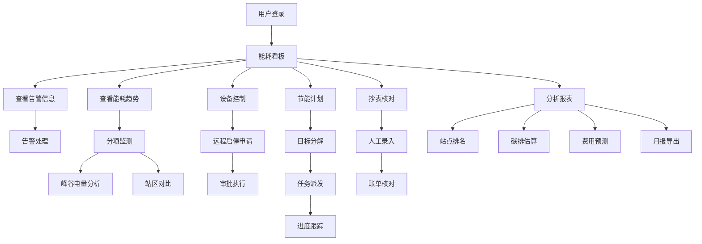

# 铁路能源管理系统 - 产品需求文档

## 1. 产品概述

铁路能源管理 Web 应用是面向铁路车站和车辆段的综合能源管理平台，实现对用电、用水、用气数据的集中监测与分析，通过智能化的能耗管理和节能任务追踪，帮助铁路部门降低运营成本，提升能源利用效率。

- **核心目标**：实现能源数据可视化、设备远程管控、节能计划落地、异常告警及时响应
- **目标用户**：车站管理人员、车辆段运维人员、能源管理专员、上级监管部门

## 2. 核心功能

### 2.1 用户角色

| 角色 | 核心权限 |
|------|----------|
| 系统管理员 | 全功能访问、用户管理、系统配置 |
| 能源管理员 | 能耗数据查看、节能计划制定、设备控制、告警处理 |
| 运维人员 | 设备状态查看、远程启停申请、抄表录入、任务执行 |
| 访客 | 能耗看板浏览、报表查看 |

### 2.2 功能模块

1. **能耗看板**：综合能耗概览、关键指标展示、趋势图表、告警提醒
2. **分项监测**：电/水/气分项能耗、站区分布对比、峰谷电量分析
3. **设备控制**：空调/照明设备状态、远程启停申请、运行时长统计
4. **告警中心**：异常波动提醒、漏水疑似提示、告警处理记录
5. **节能计划**：节能目标分解、整改任务派发、任务进度跟踪
6. **抄表核对**：人工抄表录入、账单核对、异常标记
7. **分析报表**：同类站点排名、碳排估算、费用预测、月报导出

### 2.3 页面详情

| 页面名称 | 模块名称 | 功能描述 |
|---------|---------|----------|
| 能耗看板 | 总览卡片 | 展示今日/本月累计能耗、同比环比数据、节能完成率 |
| 能耗看板 | 趋势图表 | 展示近7天/30天能耗趋势折线图、能耗构成饼图 |
| 能耗看板 | 站区分布 | 各站区能耗排名柱状图、实时告警列表 |
| 分项监测 | 能耗分类 | 电/水/气三种类别切换、各分类详细数据 |
| 分项监测 | 峰谷分析 | 峰谷平各时段电量统计、分时电价费用计算 |
| 分项监测 | 站区对比 | 多站区能耗横向对比、单位面积能耗指标 |
| 设备控制 | 设备列表 | 空调/照明设备运行状态、当前功率、运行时长 |
| 设备控制 | 远程控制 | 设备启停申请、调度审批、操作记录 |
| 设备控制 | 运行统计 | 设备开机率、累计运行时长、能耗排名 |
| 告警中心 | 实时告警 | 异常能耗波动、疑似漏水、设备故障告警 |
| 告警中心 | 告警处理 | 告警确认、派单处理、关闭记录 |
| 告警中心 | 统计分析 | 告警类型分布、处理时效统计 |
| 节能计划 | 目标管理 | 年度/季度节能目标设定、分解到站区 |
| 节能计划 | 任务派发 | 整改任务创建、责任人分配、截止日期 |
| 节能计划 | 进度跟踪 | 任务完成率、节能效果评估 |
| 抄表核对 | 抄表录入 | 人工抄表数据录入、历史数据查询 |
| 抄表核对 | 账单核对 | 系统数据与账单对比、差异标记 |
| 抄表核对 | 异常处理 | 数据异常标记、复核流程 |
| 分析报表 | 站点排名 | 同类站点能耗排名、能效指标对比 |
| 分析报表 | 碳排放估算 | 能耗折算碳排放量、减排量统计 |
| 分析报表 | 费用预测 | 基于历史数据的下月费用预测 |
| 分析报表 | 月报导出 | 月度能耗报告生成、Excel/PDF 导出 |

## 3. 核心流程

### 3.1 主要用户流程

1. **日常监控流程**：用户登录 → 进入能耗看板 → 查看关键指标 → 浏览告警信息 → 处理待办事项
2. **设备控制流程**：进入设备控制 → 选择设备 → 提交启停申请 → 调度审批 → 执行操作 → 记录日志
3. **节能任务流程**：制定节能目标 → 分解到站区 → 派发整改任务 → 跟踪执行 → 效果评估
4. **抄表核对流程**：录入抄表数据 → 系统自动比对 → 标记异常 → 复核确认 → 生成账单

### 3.2 业务流程图

## 4. 用户界面设计

### 4.1 设计风格

- **设计理念**：工业科技风，体现铁路行业的严谨性和现代化管理水平
- **主色调**：深蓝 (#0F2B5B) - 体现专业、可靠
- **辅助色**：科技蓝 (#2563EB)、能源绿 (#10B981)、警示橙 (#F59E0B)、告警红 (#EF4444)
- **背景色**：深灰蓝 (#0F172A)、卡片灰 (#1E293B)
- **字体**：主字体使用 "Noto Sans SC"，数字字体使用 "JetBrains Mono" 等宽字体
- **布局风格**：左侧导航 + 顶部状态栏 + 主内容区的经典后台布局
- **卡片风格**：深色卡片配微妙边框，圆角 8px，悬浮提升效果
- **图标风格**：线性图标，统一 24px 尺寸

### 4.2 页面设计概览

| 页面名称 | 模块名称 | UI 元素 |
|---------|---------|---------|
| 能耗看板 | 总览卡片 | 大字号指标卡、趋势箭头、同比环比数据、渐变背景 |
| 能耗看板 | 图表区域 | ECharts 折线图/饼图/柱状图、交互式 tooltip |
| 能耗看板 | 告警列表 | 彩色告警标签、时间轴样式、处理状态标记 |
| 分项监测 | 分类标签 | Tab 切换、活跃态高亮、内容区平滑过渡 |
| 分项监测 | 数据表格 | 斑马纹、悬停高亮、排序功能 |
| 设备控制 | 设备卡片 | 状态指示灯、功率环形图、控制按钮 |
| 设备控制 | 控制模态框 | 表单验证、审批流程提示、操作确认 |
| 告警中心 | 告警列表 | 严重程度颜色编码、筛选器、批量操作 |
| 节能计划 | 甘特图样式 | 时间轴、进度条、责任人标签 |
| 分析报表 | 导出区域 | 格式选择器、日期范围、预览按钮 |

### 4.3 响应式设计

- **桌面优先**：针对 1920px 宽屏优化，支持 1366px 及以上分辨率
- **平板适配**：1024px 断点，导航栏折叠为图标模式
- **数据可视化**：图表自适应容器宽度，表格支持横向滚动
- **触控优化**：按钮最小尺寸 44px，表单元素间距合理

### 4.4 动效设计

- **页面加载**：骨架屏占位，内容渐入显示
- **数据更新**：数字滚动动画，指标卡轻微脉冲
- **告警提示**：新告警滑入动画，呼吸灯效果
- **卡片交互**：悬停时轻微上浮 + 阴影增强
- **Tab 切换**：下划线滑动过渡，内容区淡入淡出
