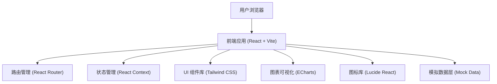

# 铁路能源管理系统 - 技术架构文档

## 1. 架构设计



## 2. 技术栈说明

- **前端框架**：React@18 - 组件化开发，高效渲染
- **构建工具**：Vite@5 - 快速冷启动，热更新
- **样式方案**：TailwindCSS@3 - 原子化 CSS，快速开发
- **路由管理**：React Router@6 - 单页应用路由
- **图表库**：ECharts@5 - 专业数据可视化
- **图标库**：Lucide React - 轻量线性图标
- **日期处理**：date-fns - 轻量日期工具库
- **数据方案**：前端 Mock 数据，无需后端

## 3. 目录结构

```
e:\trae-bz\TraeProjects\1031
├── src/
│   ├── components/          # 公共组件
│   │   ├── Layout/         # 布局组件
│   │   ├── charts/         # 图表组件
│   │   ├── cards/          # 卡片组件
│   │   └── tables/         # 表格组件
│   ├── pages/              # 页面组件
│   │   ├── Dashboard/      # 能耗看板
│   │   ├── Monitoring/     # 分项监测
│   │   ├── DeviceControl/  # 设备控制
│   │   ├── Alerts/         # 告警中心
│   │   ├── EnergyPlan/     # 节能计划
│   │   ├── MeterReading/   # 抄表核对
│   │   └── Reports/        # 分析报表
│   ├── data/               # 模拟数据
│   │   ├── mockData.js     # 业务数据
│   │   └── chartData.js    # 图表数据
│   ├── hooks/              # 自定义 Hooks
│   ├── utils/              # 工具函数
│   ├── App.jsx             # 根组件
│   ├── main.jsx            # 入口文件
│   └── index.css           # 全局样式
├── public/                 # 静态资源
├── index.html              # HTML 模板
├── package.json
├── vite.config.js
└── tailwind.config.js
```

## 4. 路由定义

| 路由路径 | 页面名称 | 功能说明 |
|---------|---------|----------|
| / | 能耗看板 | 综合能耗概览、趋势图表、告警提醒 |
| /monitoring | 分项监测 | 电/水/气分项、峰谷分析、站区对比 |
| /device-control | 设备控制 | 设备状态、远程启停、运行统计 |
| /alerts | 告警中心 | 实时告警、处理记录、统计分析 |
| /energy-plan | 节能计划 | 目标分解、任务派发、进度跟踪 |
| /meter-reading | 抄表核对 | 人工录入、账单核对、异常处理 |
| /reports | 分析报表 | 站点排名、碳排估算、费用预测、月报导出 |

## 5. 数据模型

### 5.1 能耗数据模型

```typescript
interface EnergyData {
  id: string;
  stationId: string;
  stationName: string;
  date: string;
  electricity: number;      // 用电量 (kWh)
  water: number;            // 用水量 (m³)
  gas: number;              // 用气量 (m³)
  peakElectricity: number;  // 峰时电量
  flatElectricity: number;  // 平时电量
  valleyElectricity: number; // 谷时电量
  cost: number;             // 费用 (元)
}
```

### 5.2 设备数据模型

```typescript
interface Device {
  id: string;
  name: string;
  type: 'air_conditioner' | 'lighting' | 'other';
  stationId: string;
  location: string;
  status: 'running' | 'stopped' | 'fault';
  power: number;            // 当前功率 (kW)
  runHours: number;         // 累计运行时长 (h)
  todayEnergy: number;      // 今日能耗 (kWh)
  lastMaintenance: string;  // 上次维护时间
}
```

### 5.3 告警数据模型

```typescript
interface Alert {
  id: string;
  type: 'energy_fluctuation' | 'water_leak' | 'device_fault' | 'over_limit';
  level: 'critical' | 'warning' | 'info';
  stationId: string;
  location: string;
  description: string;
  value: number;
  threshold: number;
  timestamp: string;
  status: 'pending' | 'processing' | 'resolved';
  handler?: string;
  resolvedAt?: string;
}
```

### 5.4 节能任务模型

```typescript
interface EnergyTask {
  id: string;
  title: string;
  description: string;
  stationId: string;
  assignee: string;
  startDate: string;
  endDate: string;
  targetSaving: number;     // 目标节能量
  actualSaving: number;     // 实际节能量
  status: 'pending' | 'in_progress' | 'completed' | 'overdue';
  progress: number;         // 进度 0-100
}
```

### 5.5 抄表数据模型

```typescript
interface MeterReading {
  id: string;
  meterId: string;
  meterType: 'electricity' | 'water' | 'gas';
  stationId: string;
  readingDate: string;
  readingValue: number;     // 抄表读数
  previousValue: number;    // 上期读数
  consumption: number;      // 消耗量
  recorder: string;         // 抄表人
  isVerified: boolean;      // 是否已核对
  remark?: string;
}
```

## 6. 核心组件设计

### 6.1 布局组件

- **Sidebar**: 左侧导航菜单，支持折叠/展开
- **Header**: 顶部状态栏，显示用户信息、消息、站区切换
- **MainContent**: 主内容区，带内边距和滚动

### 6.2 图表组件封装

- **LineChart**: 趋势折线图
- **BarChart**: 柱状对比图
- **PieChart**: 占比饼图/环形图
- **GaugeChart**: 仪表盘
- **AreaChart**: 面积图

### 6.3 业务组件

- **StatCard**: 统计指标卡片
- **AlertList**: 告警列表
- **DeviceCard**: 设备状态卡片
- **TaskProgress**: 任务进度条
- **DataTable**: 通用数据表格

## 7. 性能优化

- 图表懒加载，可见区域外不渲染
- 组件 memo 优化，避免不必要重渲染
- 大表格虚拟滚动
- 模拟数据分片加载
- Tailwind JIT 模式减小 CSS 体积

## 8. 浏览器兼容性

- Chrome/Edge (最新版)
- Firefox (最新版)
- Safari (最新版)
- 不支持 IE
